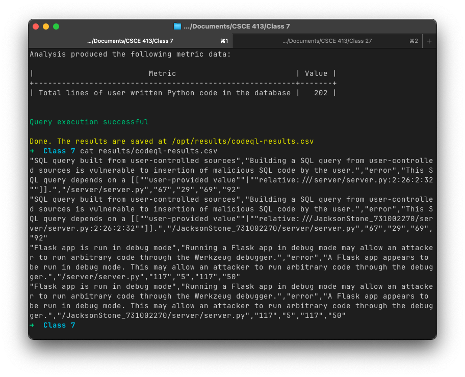
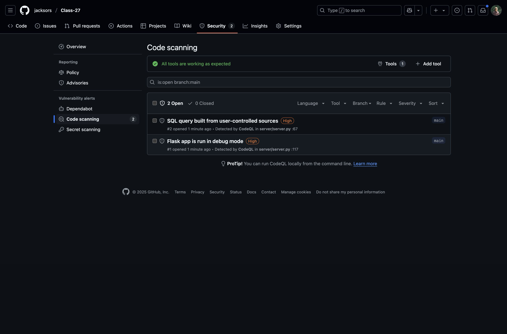

## Running locally

In order to run the codeql scan locally, the command `docker run --platform linux/amd64 --rm -v .:/opt/src -v ./results:/opt/results btnguyen2k/codeql-container scan -l python -o csv --override` was run. This command uses the `btnguyen2k/codeql-container` docker image since the official image is broken to run a scan, setting the language to python, the output format to csv, and overwriting any previous results. For this scan, class 7 SQL injection lab was used. The results were:



```
"SQL query built from user-controlled sources","Building a SQL query from user-controlled sources is vulnerable to insertion of malicious SQL code by the user.","error","This SQL query depends on a [[""user-provided value""|""relative:///server/server.py:2:26:2:32""]].","/server/server.py","67","29","69","92"
"SQL query built from user-controlled sources","Building a SQL query from user-controlled sources is vulnerable to insertion of malicious SQL code by the user.","error","This SQL query depends on a [[""user-provided value""|""relative:///JacksonStone_731002270/server/server.py:2:26:2:32""]].","/JacksonStone_731002270/server/server.py","67","29","69","92"
"Flask app is run in debug mode","Running a Flask app in debug mode may allow an attacker to run arbitrary code through the Werkzeug debugger.","error","A Flask app appears to be run in debug mode. This may allow an attacker to run arbitrary code through the debugger.","/server/server.py","117","5","117","50"
"Flask app is run in debug mode","Running a Flask app in debug mode may allow an attacker to run arbitrary code through the Werkzeug debugger.","error","A Flask app appears to be run in debug mode. This may allow an attacker to run arbitrary code through the debugger.","/JacksonStone_731002270/server/server.py","117","5","117","50"
```

This shows it was able to detect both the flask app running in debug mode and the sql injection risk.

## CICD Pipeline

For the CICD pipeline, first a `.github/workflows/codeql.yml` file was created with the following contents:

```
name: CodeQL Analysis

on:
  push:
    branches: [main]

jobs:
  analyze:
    name: Analyze CodeQL
    runs-on: ubuntu-latest
    permissions:
      actions: read
      contents: read
      security-events: write
    steps:
      - name: checkout
        uses: actions/checkout@v3
      - name: initialize
        uses: github/codeql-action/init@v2
        with:
          languages: python
      - name: autobuild
        uses: github/codeql-action/autobuild@v2
      - name: analysis
        uses: github/codeql-action/analyze@v2
```

Then, the repository was created in GitHub (https://github.com/jacksors/Class-27/). When the action was run on push, it successfully detected the same vulnerabilities in the scan.

